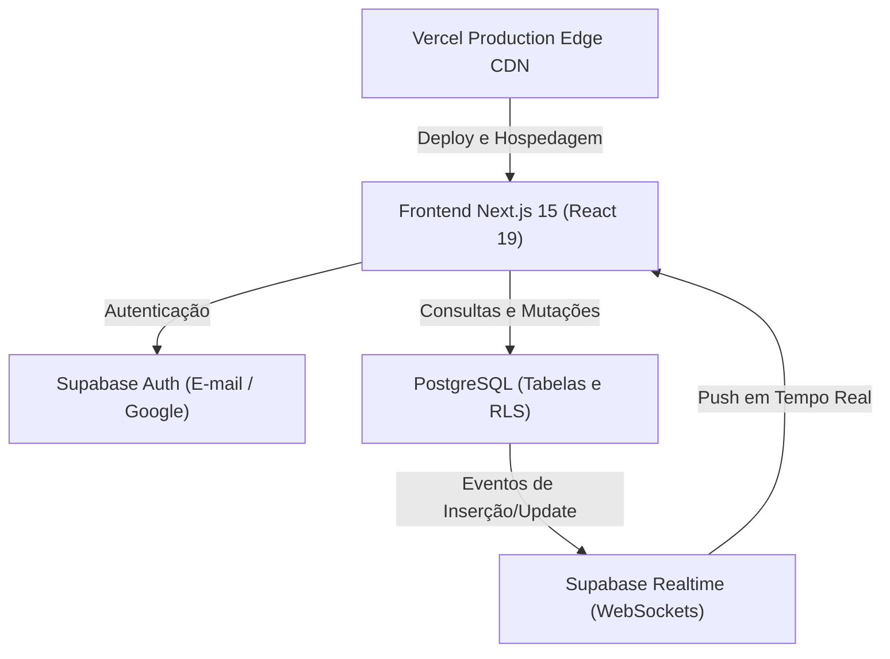
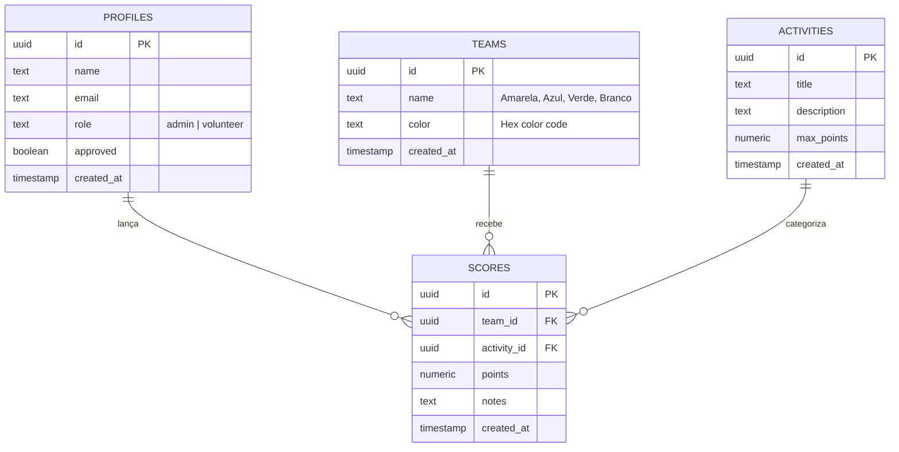
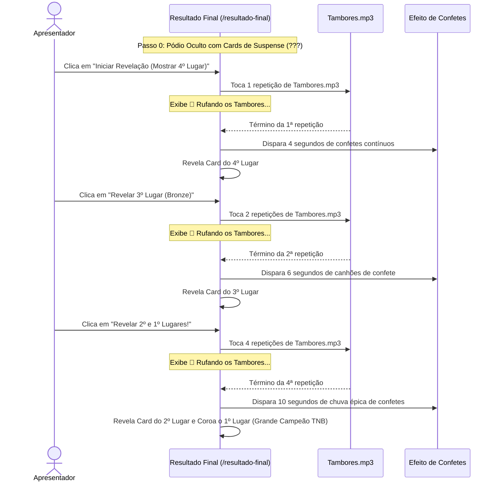

# 📘 Documentação Técnica — App Gincana Tô na Bênção (TNB)
**Ministério Infantil Tô na Bênção | Igreja Bíblica da Paz (IBP)**  
*Acampamento TNB 2026 — "Embaixadores do Reino"*

---

## 1. Visão Geral do Sistema

O **App Gincana TNB** é uma aplicação web progressiva em tempo real desenvolvida para gerenciar, auditar e projetar toda a pontuação da gincana das equipes durante o Acampamento Infantil do Ministério Tô na Bênção (IBP).

A aplicação foi projetada para garantir:
1. **Auditoria e Confiabilidade:** Lançamentos precisos com histórico detalhado e validação inteligente de rodadas pendentes.
2. **Sincronização em Tempo Real:** Atualização instantânea entre os dispositivos dos líderes de prova e o telão de projeção do auditório sem necessidade de recarregar páginas.
3. **Experiência Visual e Sonoplastia:** Telão imersivo e cerimônia de premiação com automação de bateria de suspense (rufar de tambores), explosões de confetes e player de áudio oficial ("Mais que Vencedores").
4. **Resiliência Offline / Fallback:** Capacidade de operar com dados locais em `localStorage` caso a conexão de rede oscile.

---

## 2. Stack Tecnológica e Arquitetura



### 2.1. Tecnologias Principais
- **Framework:** [Next.js 15](https://nextjs.org/) (App Router, Server & Client Components)
- **Biblioteca de UI:** [React 19](https://react.dev/)
- **Linguagem:** [TypeScript 5](https://www.typescriptlang.org/) (Tipagem estrita)
- **Estilização:** [Tailwind CSS v4](https://tailwindcss.com/) com suporte a classes de tema e `@tailwindcss/postcss`
- **Ícones:** [Lucide React](https://lucide.dev/)
- **Animação e Efeitos:** [canvas-confetti](https://www.npmjs.com/package/canvas-confetti)
- **Banco de Dados & Autenticação:** [Supabase](https://supabase.com/) (PostgreSQL 15 + PostgREST + Realtime via WebSockets)
- **Deploy & Infraestrutura:** [Vercel](https://vercel.com/) integrado ao repositório GitHub

---

## 3. Estrutura de Diretórios e Arquitetura de Código

```
d:\Projetos\App Acampa/
├── docs/                               # Documentações técnicas e manuais
│   ├── DOCUMENTACAO_TECNICA.md
│   └── GUIA_DO_VOLUNTARIO.md
├── public/                             # Recursos estáticos (áudios, logos, imagens)
│   ├── Mais que Vencedores.mp3 / .mpeg # Trilha sonora oficial do acampamento
│   ├── Tambores.mp3                    # Bateria de suspense (rufar de tambores)
│   ├── Logo_TNB.png                    # Identidade visual Tô na Bênção
│   └── logo-treinando-campeoes.png     # Logo oficial da gincana
├── src/
│   ├── app/
│   │   ├── globals.css                 # Configurações globais de CSS e Tailwind v4
│   │   ├── layout.tsx                  # Layout raiz com fontes, ThemeProvider e AuthProvider
│   │   ├── page.tsx                    # Painel do Voluntário / Dashboard Principal
│   │   ├── telao/
│   │   │   └── page.tsx                # Tela de Projeção Pública (/telao)
│   │   └── resultado-final/
│   │       └── page.tsx                # Cerimônia de Premiação e Pódio (/resultado-final)
│   ├── components/
│   │   ├── ActivityManager.tsx         # Gestão de atividades e provas (Admin)
│   │   ├── AuthContext.tsx             # Contexto de autenticação, perfis e permissões
│   │   ├── AuthScreen.tsx              # Tela de Login e Cadastro de voluntários
│   │   ├── CaboDeGuerraTable.tsx       # Tabela interativa de duelos do Cabo de Guerra
│   │   ├── EditScoreModal.tsx          # Modal de edição de lançamentos já realizados
│   │   ├── Header.tsx                  # Barra superior de navegação, status e player
│   │   ├── Leaderboard.tsx             # Tabela de classificação geral das equipes
│   │   ├── PendingApprovalScreen.tsx   # Tela de bloqueio para contas aguardando aprovação
│   │   ├── Podium.tsx                  # Visualização do pódio de 1º a 4º lugares
│   │   ├── ScoreHistory.tsx            # Histórico auditável de pontuações
│   │   ├── ScoreModal.tsx              # Modal de lançamento de notas e controle de rodadas
│   │   ├── SuspenseDrumRollButton.tsx  # Botão sonoro de Rufar de Tambores avulso
│   │   ├── TaskCompletionAlert.tsx     # Alerta de validação de provas incompletas
│   │   ├── TeamManager.tsx             # Gestão de equipes (Admin)
│   │   ├── ThemeProvider.tsx           # Alternância de Modo Escuro / Claro
│   │   ├── UserManager.tsx             # Painel de aprovação e promoção de usuários (Admin)
│   │   └── VinylAudioPlayer.tsx        # Toca-discos de vinil com "Mais que Vencedores"
│   ├── hooks/
│   │   └── useGincanaData.ts           # Hook central de estado, cache e realtime Supabase
│   └── lib/
│       ├── mockData.ts                 # Dados pré-configurados de equipes e provas oficiais
│       ├── supabase.ts                 # Cliente singleton e validação de chaves do Supabase
│       ├── taskCompletion.ts           # Regras de negócio de rodadas mínimas por prova
│       └── types.ts                    # Interfaces e tipos do modelo de dados
├── supabase/
│   ├── schema.sql                      # DDL do banco de dados (tabelas, índices, RLS)
│   └── add_admins.sql                  # Script de promoção de administradores
└── package.json
```

---

## 4. Modelo de Dados e Banco de Dados (Supabase PostgreSQL)

### 4.1. Esquema Entidade-Relacionamento



### 4.2. Detalhes das Tabelas

1. **`teams`**:
   - `id`: Identificador único (UUID ou slug no mock).
   - `name`: Nome da equipe (Amarela, Azul, Verde, Branco).
   - `color`: Código hexadecimal da cor oficial.

2. **`activities`**:
   - `id`: Identificador único da prova.
   - `title`: Título da prova (ex: *Prova 1 - Treino da Palavra: "Mapa da Jornada"*).
   - `description`: Critérios, regras de pontuação e quantidade de rodadas.
   - `max_points`: Teto máximo de pontuação teórica.

3. **`scores`**:
   - `id`: Identificador único do lançamento.
   - `team_id`: Chave estrangeira para `teams.id`.
   - `activity_id`: Chave estrangeira (opcional) para `activities.id`.
   - `points`: Valor inteiro ou decimal da pontuação atribuída (positivo ou negativo).
   - `notes`: Justificativa ou detalhe do lançamento (ex: "Rodada 2 - 1º lugar").
   - `created_at`: Carimbo de data/hora do lançamento.

4. **`profiles`**:
   - `id`: Vinculado a `auth.users.id`.
   - `name`: Nome do voluntário.
   - `email`: Endereço de e-mail.
   - `role`: Papel de acesso (`volunteer` ou `admin`).
   - `approved`: Flag booleana controlando se o usuário já foi aprovado para operar a plataforma.

### 4.3. Sincronização em Tempo Real (Supabase Realtime)
No hook [`src/hooks/useGincanaData.ts`](file:///d:/Projetos/App%20Acampa/src/hooks/useGincanaData.ts), uma subscrição WebSocket escuta todos os canais:
```typescript
supabase
  .channel('gincana_realtime_channel')
  .on('postgres_changes', { event: '*', schema: 'public', table: 'scores' }, () => reloadScores())
  .on('postgres_changes', { event: '*', schema: 'public', table: 'teams' }, () => reloadTeams())
  .on('postgres_changes', { event: '*', schema: 'public', table: 'activities' }, () => reloadActivities())
  .subscribe((status) => {
    setRealtimeConnected(status === 'SUBSCRIBED');
  });
```
Isso assegura latência inferior a 100ms entre o clique do voluntário no celular e a atualização gráfica no telão.

---

## 5. Regras de Negócio e Mecânicas de Pontuação

### 5.1. Equipes Oficiais e Acessibilidade Visual
Para garantir contraste adequado em projetores e telas de celular:
- **Amarela (`#f59e0b`):** Amarelo vibrante com texto de contraste escuro.
- **Azul (`#3b82f6`):** Azul Real com texto branco.
- **Verde (`#10b981`):** Verde Esmeralda com texto branco.
- **Branco (`#e2e8f0`):** Branco com **texto PRETO (`text-slate-950`)** e borda/sombra reforçada para nunca sumir contra fundos claros ou escuros.

### 5.2. Provas com 5 Rodadas Obrigatórias
As Provas 1, 2, 3, 4 e 5 seguem o modelo de 5 baterias/rodadas por equipe:
- **Pontuação por rodada:**
  - 1º lugar na rodada: **4 pontos**
  - 2º lugar na rodada: **3 pontos**
  - 3º lugar na rodada: **2 pontos**
  - 4º lugar na rodada: **1 ponto**
- **Validação de Rodadas no Modal (`ScoreModal.tsx`):**
  - O sistema detecta o histórico de lançamentos da equipe selecionada naquela prova.
  - Exibe o progresso: *"Lançando Rodada X de 5"*.
  - Quando a equipe completa 5 lançamentos, bloqueia lançamentos excedentes acidentais e avisa quais outras equipes ainda estão pendentes.

### 5.3. Fase 2.1 — Cabo de Guerra (Duelos Todos contra Todos)
Implementada no componente [`src/components/CaboDeGuerraTable.tsx`](file:///d:/Projetos/App%20Acampa/src/components/CaboDeGuerraTable.tsx):
- Com 4 equipes, ocorrem exatamente **6 confrontos diretos**:
  1. Amarela × Azul
  2. Amarela × Verde
  3. Amarela × Branco
  4. Azul × Verde
  5. Azul × Branco
  6. Verde × Branco
- Ao marcar o vencedor de cada duelo, o sistema calcula o número de vitórias de cada time.
- Em caso de empate no número de vitórias, permite desempate direto.
- Gera automaticamente os pontos finais da fase:
  - 1º lugar no Cabo de Guerra: **4 pontos**
  - 2º lugar no Cabo de Guerra: **3 pontos**
  - 3º lugar no Cabo de Guerra: **2 pontos**
  - 4º lugar no Cabo de Guerra: **1 ponto**

---

## 6. Telão de Projeção em Tempo Real (`/telao`)

Localizado em [`src/app/telao/page.tsx`](file:///d:/Projetos/App%20Acampa/src/app/telao/page.tsx):
- **Otimização para Alta Resolução:** Tipografia escalada, animações suaves em CSS e cards responsivos para 1080p e 4K.
- **Indicador de Conexão em Tempo Real:** Badge pulsante verde `Tempo Real Ativo` informando estabilidade da conexão WebSocket.
- **Botão de Confetes:** Disparo sob demanda via tecla de atalho ou clique para celebrar momentos especiais da gincana.
- **Bateria de Suspense:** Botão compacto com `Tambores.mp3` para criar clima de expectativa durante dinâmicas presenciais.
- **Controle de Tela Cheia:** Alternância nativa com a API Fullscreen do navegador.
- **Toca-discos Flutuante:** Execução em loop da música "Mais que Vencedores", com fallback automático de formatos (`.mpeg` / `.mp3`).

---

## 7. Cerimônia de Resultado Final (`/resultado-final`)

Localizada em [`src/app/resultado-final/page.tsx`](file:///d:/Projetos/App%20Acampa/src/app/resultado-final/page.tsx):
Tela cinematográfica para encerramento oficial do acampamento com lógica sequencial em 3 passos:



### Regras Específicas do Frontend de Revelação:
- **Ausência de Contadores Numéricos:** As strings `(1/2)` ou `(1 de 2)` foram completamente suprimidas do visual para garantir impacto cinematográfico, mantendo apenas o ícone do tambor animado (`🥁`) e a legenda fixa `"Rufando os Tambores"`.
- **Botão de Reiniciar:** Permite resetar o passo da revelação a qualquer momento sem perder os dados das equipes no banco de dados.

---

## 8. Design System e Temas (Claro / Escuro)

Implementado com [`src/components/ThemeProvider.tsx`](file:///d:/Projetos/App%20Acampa/src/components/ThemeProvider.tsx):
- **Modo Padrão:** **Modo Escuro (`dark`)** para todas as telas, otimizando o contraste de cores de alta saturação das equipes em projetores.
- **Modo Claro (`light`):** Utiliza o azul institucional do Ministério Infantil Tô na Bênção (`#78c8fb` / `#0284c7`), com gradientes celestes suaves e cards em vidro fosco (`backdrop-blur`).
- **Persistência:** A preferência de tema é salva no `localStorage` sob a chave `tnb_theme`.

---

## 9. Procedimentos de Build, Deploy e Verificação

### 9.1. Comandos de Desenvolvimento e Produção
```bash
# Instalação de dependências
npm install

# Execução em ambiente local de desenvolvimento
npm run dev

# Build de produção e verificação de tipos TypeScript
npm run build

# Execução local do build compilado
npm run start
```

### 9.2. Deploy em Produção (Vercel)
O projeto está configurado para deploy contínuo via Vercel:
- **Repositório GitHub:** `rodrigocsantos1-git/app-gincana-tnb` (Branch `main`)
- **URL de Produção:** [https://gincana-tnb.vercel.app](https://gincana-tnb.vercel.app)
- **Comando de deploy manual via CLI:**
  ```bash
  npx vercel --prod --yes
  npx vercel alias set <deployment-url> gincana-tnb.vercel.app
  ```

---

## 10. Resumo de Segurança e Proteção Infantil
Seguindo os padrões do **Ministério Infantil Tô na Bênção (IBP)**:
1. **Moderação Estrita:** Nenhum termo chulo, gíria pejorativa ou apelido ofensivo é permitido no cadastro de equipes, notas ou voluntários.
2. **Controle de Acesso:** Usuários recém-cadastrados necessitam de aprovação ativa por um Administrador para lançar ou alterar notas.
3. **Imutabilidade e Backup:** A tela de histórico de notas permite exportar backups em JSON e auditar todas as pontuações registradas.
