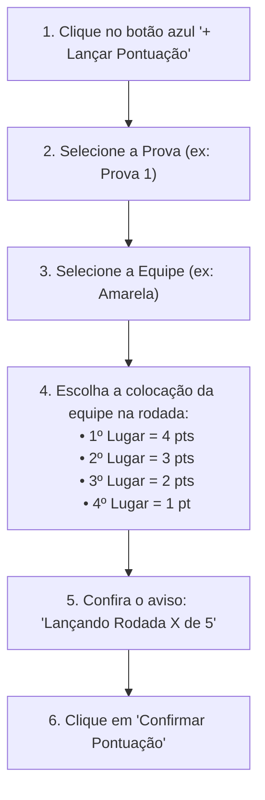
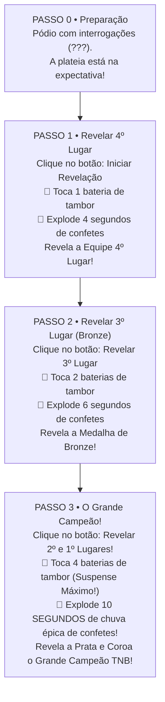

# 🏅 Manual do Voluntário — App Gincana Tô na Bênção (TNB)
**Ministério Infantil Tô na Bênção | Igreja Bíblica da Paz (IBP)**  
*Acampamento TNB 2026 — "Embaixadores do Reino"*

---

> 💛 **Bem-vindo, Voluntário TNB!**  
> Este guia prático foi preparado com muito carinho para que você tenha total segurança e tranquilidade ao lançar as notas das equipes e conduzir as projeções no Telão e na Cerimônia de Premiação. Você faz parte de um ministério que aponta crianças para Jesus!

---

## 1. Como Acessar a Plataforma

- **Link Oficial do Sistema:** [https://gincana-tnb.vercel.app](https://gincana-tnb.vercel.app)
- **Aparelhos Compatíveis:** Pode ser acessado diretamente pelo seu smartphone, tablet ou pelo computador/notebook da mesa de som e projeção.

### 1.1. Primeiro Acesso e Cadastro
1. Ao abrir o site pela primeira vez, você verá a tela de **Login / Cadastro**.
2. Clique na aba **"Criar Conta"**.
3. Preencha seu **Nome completo**, **E-mail** e crie uma **Senha** segura.
4. Clique em **"Cadastrar"**.
5. ⏳ **Aguardando Aprovação:** Por questões de segurança das crianças e integridade da pontuação, sua conta passará por uma aprovação rápida do líder/administrador. Assim que aprovada, você terá acesso imediato a todas as funções!

---

## 2. Conhecendo as Equipes da Gincana

A gincana conta com **4 equipes oficiais**:

| Equipe | Cor | Visual no Sistema | Dica de Identificação |
| :--- | :--- | :--- | :--- |
| **Amarela** | 🟡 Amarelo Ouro | Fundo amarelo vibrante com letras escuras | Camisetas ou fitas amarelas |
| **Azul** | 🔵 Azul Real | Fundo azul com letras brancas | Camisetas ou fitas azuis |
| **Verde** | 🟢 Verde Esmeralda | Fundo verde com letras brancas | Camisetas ou fitas verdes |
| **Branco** | ⚪ Branco / Prata | Fundo branco com borda destacada e **letras pretas** | Camisetas ou fitas brancas |

---

## 3. Passo a Passo: Lançando Pontuações nas Provas

### 3.1. Provas Regulares com 5 Rodadas (Provas 1, 2, 3, 4 e 5)
As provas de 1 a 5 possuem **5 baterias/rodadas obrigatórias** para cada equipe.



#### Dica de Ouro sobre as 5 Rodadas:
- O próprio sistema conta quantas rodadas a equipe já jogou.
- Quando uma equipe atinge a 5ª rodada, o sistema comemora com confetes e avisa na tela: *"Equipe completou todas as 5 rodadas da prova!"*.
- Logo abaixo, o sistema mostra uma lista de quais equipes ainda faltam lançar para que nenhuma criança fique sem sua nota.

---

### 3.2. Prova Especial: Fase 2.1 — Cabo de Guerra

O Cabo de Guerra é uma disputa de **duelo direto (todos contra todos)**.

1. No menu de provas, selecione **"Fase 2.1 - Cabo de Guerra"** (ou clique no card do Cabo de Guerra no painel).
2. O sistema abrirá a **Tabela de Confrontos** com os 6 duelos programados:
   - *Amarela × Azul*
   - *Amarela × Verde*
   - *Amarela × Branco*
   - *Azul × Verde*
   - *Azul × Branco*
   - *Verde × Branco*
3. Conforme o juiz da prova apitar o vencedor de cada puxada:
   - Clique no botão do time vencedor daquele duelo.
   - O sistema marcará um check verde (✅) na vitória da equipe.
4. Quando todos os 6 duelos terminarem:
   - A tabela classifica automaticamente quem teve mais vitórias.
   - O sistema distribui a pontuação geral da fase:
     - **1º Lugar:** 4 pontos
     - **2º Lugar:** 3 pontos
     - **3º Lugar:** 2 pontos
     - **4º Lugar:** 1 ponto
   - Clique em **"Confirmar e Salvar Pontuações do Cabo de Guerra"**.

---

### 3.3. Provas Especiais (Caça ao Tesouro, Grito de Guerra, Fantasia)
- **Caça ao Tesouro:** 
  - 1º Lugar: **10 pontos** | 2º Lugar: **8 pontos** | 3º Lugar: **6 pontos** | 4º Lugar: **4 pontos**.
- **Grito de Guerra & Melhor Fantasia:**
  - Possuem notas avaliadas pelos jurados (pontuação livre até 50 pontos).
  - Você pode digitar o valor exato da nota e adicionar uma observação (ex: *"Equipe muito animada e organizada"*).

---

## 4. Como Corrigir ou Excluir uma Nota Lançada Errada

Errou a nota de uma rodada? Não se preocupe! Tudo pode ser ajustado:

1. Na tela principal, role até a seção **"Histórico de Pontuações"**.
2. Encontre o lançamento que precisa ser corrigido (você pode filtrar por equipe ou prova).
3. **Para Editar:** Clique no ícone de lápis (✏️ **Editar**), mude os pontos e salve.
4. **Para Excluir:** Clique no ícone de lixeira (🗑️ **Excluir**) e confirme. A pontuação da equipe será recalculada instantaneamente em todas as telas e no telão!

---

## 5. Operando a Tela do Telão (`/telao`)

A tela do Telão foi feita para ser projetada no projetor principal ou nas TVs do acampamento para os participantes acompanharem a tabela em tempo real.

- **Link Direto:** [https://gincana-tnb.vercel.app/telao](https://gincana-tnb.vercel.app/telao)

```
┌─────────────────────────────────────────────────────────────┐
│ 📺 RECOMENDAÇÃO PARA O VOLUNTÁRIO DO TELÃO:                 │
│ Deixe o computador da projeção conectado a esta tela!       │
│ Conforme os voluntários lançarem as notas pelo celular,      │
│ o Telão se atualiza SOZINHO, sem precisar dar F5 na página! │
└─────────────────────────────────────────────────────────────┘
```

### Controles Úteis na Barra Superior do Telão:
- **🔲 Tela Cheia (Fullscreen):** Clique no botão com quatro setas para o telão preencher toda a tela do projetor sem barras do navegador.
- **🌓 Alternar Modo Claro / Escuro:** 
  - **Escuro (Padrão):** Ideal para salões com luzes apagadas ou iluminação cênica.
  - **Claro:** Exibe o lindo azul oficial do Ministério Infantil Tô na Bênção.
- **✨ Botão de Soltar Confetes:** Clique para comemorar um momento marcante ou uma grande virada no placar!
- **🥁 Botão Bateria de Suspense:** Toca o som dos tambores avulsos se o apresentador no palco pedir suspense antes de anunciar um aviso.
- **💿 Toca-Discos de Vinil ("Mais que Vencedores"):** 
  - Toca a música tema oficial do acampamento em segundo plano.
  - Você pode pausar, ajustar o volume ou mutar a qualquer instante com um clique no toca-discos.

---

## 6. Apresentando a Grande Cerimônia do Resultado Final (`/resultado-final`)

Chegou a hora mais esperada do acampamento! A revelação do grande campeão!

- **Link Direto:** [https://gincana-tnb.vercel.app/resultado-final](https://gincana-tnb.vercel.app/resultado-final)
- **Como Funciona:** O pódio começa totalmente misterioso, com placas de interrogação (???). O apresentador ou operador vai revelando posição por posição com bateria de tambores e explosões automáticas de confetes!



### Dicas Importantes para a Cerimônia:
1. **Não precisa controlar o som dos tambores manualmente:** Ao clicar no botão de revelar, o sistema toca sozinho a quantidade exata de baterias de suspense e libera a equipe vencedora no momento certo da batida final!
2. **Confetes Automáticos:** Você não precisa apertar para soltar confetes durante o suspense; o sistema dispara os confetes massivos automaticamente assim que a equipe é revelada.
3. **Botão de Reiniciar:** Caso queira ensaiar antes do culto começar, clique no botão **"Reiniciar"** (🔄) para voltar ao início sem apagar nenhuma nota das equipes.

---

## 7. Checklist Rápido do Voluntário TNB

- [ ] Meu celular está carregado e conectado no Wi-Fi do acampamento.
- [ ] Minha conta está logada e com status aprovado.
- [ ] Sei qual prova estou responsável por acompanhar.
- [ ] Lembrei de conferir se cada equipe teve suas 5 rodadas pontuadas.
- [ ] O notebook do telão está no link `/telao` e em modo Tela Cheia.
- [ ] No encerramento, o notebook do telão mudou para o link `/resultado-final`.
- [ ] Tudo feito com excelência, alegria e amor para a glória de Deus!

> *"Portanto, meus amados irmãos, sede firmes, inabaláveis e sempre abundantes na obra do Senhor, sabendo que, no Senhor, o vosso trabalho não é vão."* — **1 Coríntios 15:58**
